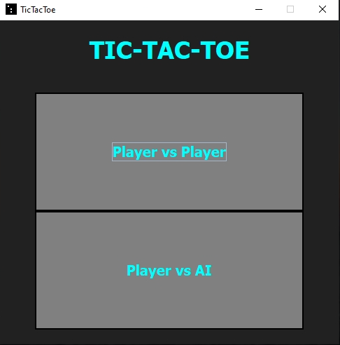
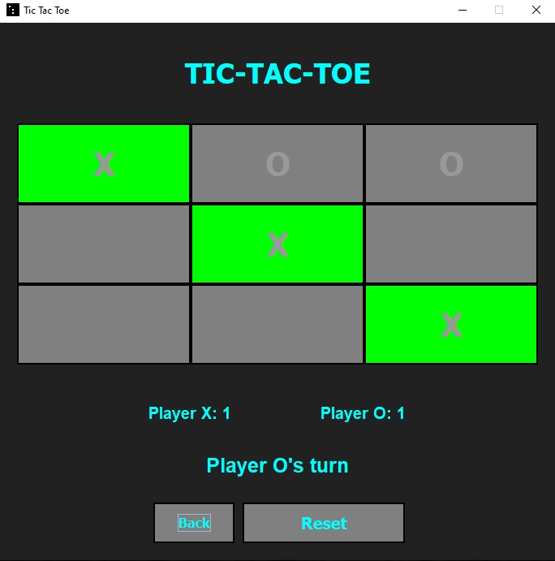
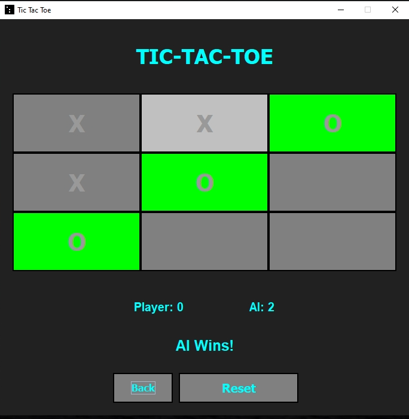

# Tic-Tac-Toe

## Overview
This is a simple Tic-Tac-Toe game implemented in Java with a graphical user interface (GUI). The game allows for two modes: Player vs Player and Player vs AI.



## Features
- **Player vs Player mode:** Two players can play against each other on the same computer.
- **Player vs AI mode:** A single player can play against an AI opponent.
- **Score tracking:** The game keeps track of the score for each player.
- **Winning line highlight:** The winning line is highlighted when a player wins.
- **Reset and back buttons:** Reset the game or go back to the game lobby.
- **Dark mode theme:** The game has a dark mode theme for a sleek look.
- **Customizable icon:** The game icon can be customized.



## AI Logic
The AI opponent in the Player vs AI mode uses a strategic algorithm to determine its moves:
- **Winning move:** If the AI has a winning move available, it will play that move to win the game.
- **Blocking move:** If the player has a winning move available, the AI will play a move to block the player from winning.
- **Forking move:** The AI will try to create a forking opportunity, where it has two possible ways to win on the next turn.
- **Opposite corner:** If the player occupies a corner and the center, the AI will occupy the opposite corner to block possible winning moves.
- **Empty side:** If none of the above conditions are met, the AI will occupy an empty side square.

  


## Installation
### Requirements
- Java Development Kit (JDK) installed on your machine.
- Launch4j tool for creating Windows executables (optional for deployment).

### Steps
1. Clone or download the repository to your local machine.
2. Compile the Java files using the following command:
3. Run the game using the following command:
   ```
   javac *.java
   java TicTacToeGUI
   ```
5. (Optional) To deploy the GUI part of the project as a standalone Windows executable using Launch4j, follow these steps:
- Download and install Launch4j from [here](http://launch4j.sourceforge.net/).
- Open Launch4j and configure the settings:
  - Set the output file path and name.
  - Set the Jar path to the compiled Jar file.
  - Set the icon file path for the executable icon (optional).
  - Set the classpath to the main class (TicTacToeGUI).
- Click on the Build Wrapper button to create the executable.

  ## Download
You can download here the executable version of the game for Windows from the following link:

[Download TicTacToeGUI.zip](https://1drv.ms/f/s!AkCS1XQDzk6boyWUasMBHVqvbiq7?e=nqUPCe)


## How to Play
- **Player vs Player mode:** Click on a button to place your symbol (X or O).
- **Player vs AI mode:** Play against the AI, which makes intelligent moves to win or block your moves.
- The first player to get three of their symbols in a row (horizontally, vertically, or diagonally) wins the game.
- Click the Reset button to start a new game.
- Click the Back button to return to the game lobby.

## Credits
This game was created by Keiru.

